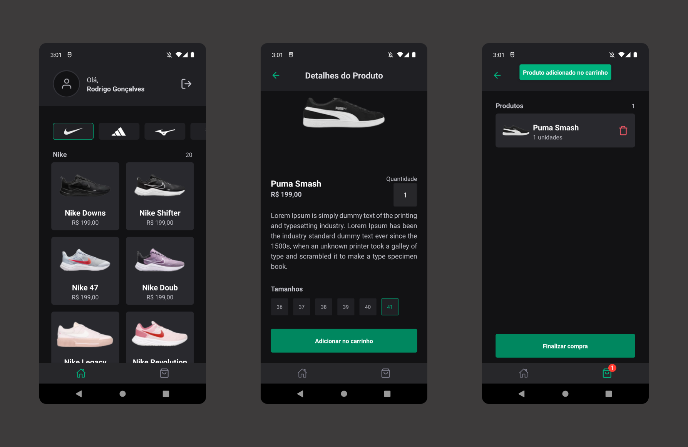

<h1 align="center"> igniteshoes </h1>

  <a href="#-tecnologias">Tecnologias</a>&nbsp;&nbsp;&nbsp;|&nbsp;&nbsp;&nbsp;
  <a href="#-projeto">Projeto</a>&nbsp;&nbsp;&nbsp;|&nbsp;&nbsp;&nbsp;
  <a href="#memo-licença">Licença</a>

  

 

  

## 🚀 Tecnologias

Esse projeto foi desenvolvido com as seguintes tecnologias:

- React Native
- Expo
- TypeScript
- OneSignal

## 🔥 Algumas features neste projeto

- Aplicação de push-notifications e deep-linking com OneSignal

## 💻 Projeto

- Está é uma aplicação que simula uma loja online criada com React Native para exercitar os conceitos
  de Push Notifications e deep linking.

## ✅ Esse projeto foi criado ao longo do curso Ignite React Native da plataforma Rocketseat

## 📝 Licença

Esse projeto está sob a licença MIT.

---
